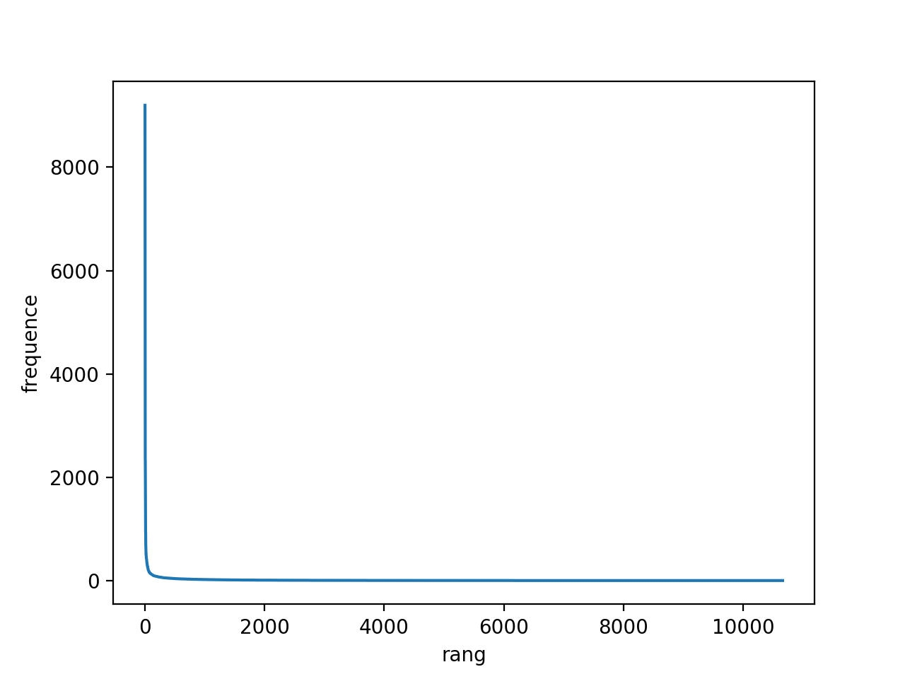
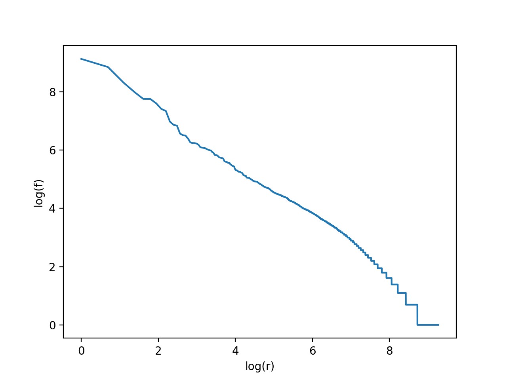
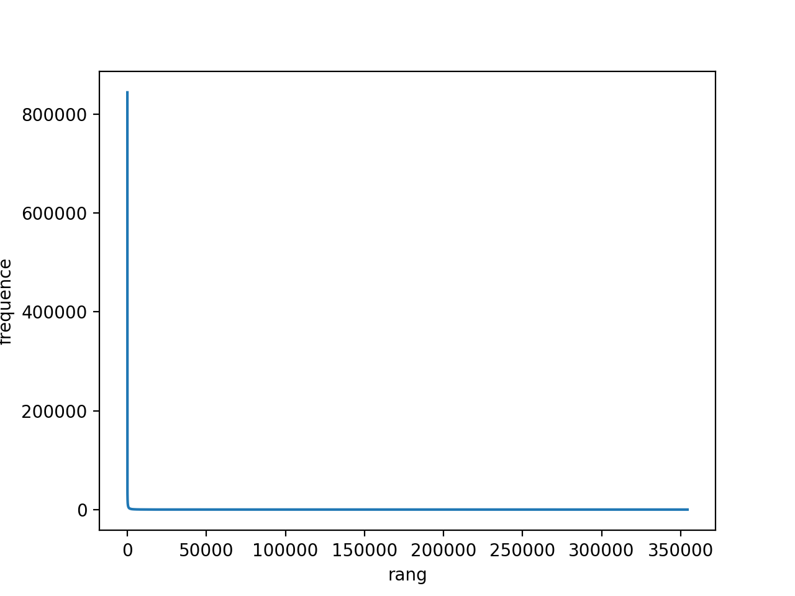
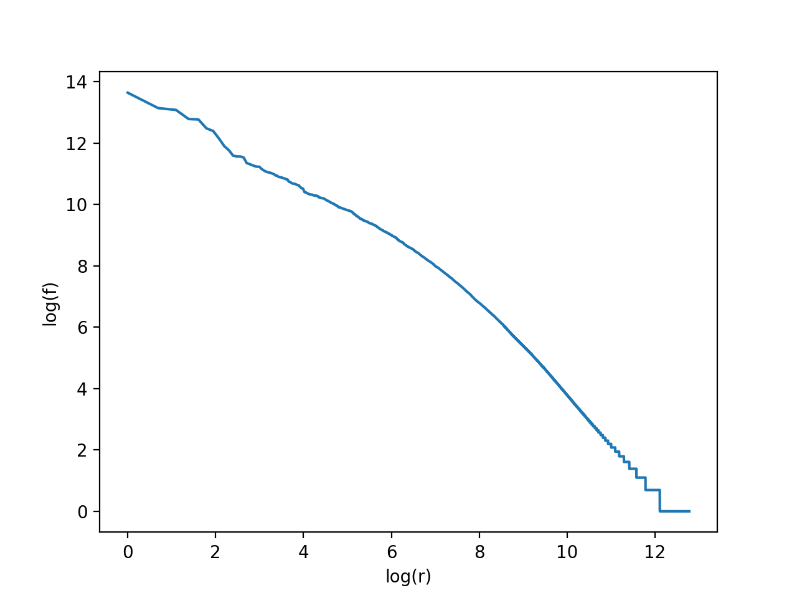

OSY 2018-2019

# **Fondements de la Recherche d’Information-WEB**

# _Hugo Martinet_

## Création d'un index inversé et moteur de recherche booléen et vectoriel

### _CACM_

_Question 1_

La collection CACM contient $T = 131\ 915$ tokens. Ici, le choix a été fait de retirer les caractères spéciaux, i.e. _user-oriented_ devient un seul mot _useroriented_ (et non pas _user_ et _oriented_) etc.

_Question 2_

La taille du vocabulaire de la collection CACM est $M = 10\ 662$. Mêmes hypothèses que pour la question précédente.

_Question 3_

Pour la moitié de la collection, il y a $T_{\frac{1}{2}} = 41\ 264$ tokens, et la taille du vocabulaire est $M_{\frac{1}{2}} = 5\ 942$.  
Or $$M = kT^{b}$$  $$M_{\frac{1}{2}} = kT_{\frac{1}{2}}^{b}$$ Alors $$b = \frac{log(10\ 662)-log(5\ 942)}{log(131\ 915)-log(41\ 264)}$$
Ainsi $b = 0,5031$ et donc $k = 28,3$.

_Question 4_

À partir de la question précédente, si $T = 1\ 000\ 000$, alors $M = 29\ 538$.

_Question 5_

Graphe de la fréquence _(f)_ en fonction du rang _(r)_

Graphe de _log(f)_ en fonction de _log(r)_

 
 

### _Cs276_

_Question 1_

La collection Cs276 contient $T = 22\ 648\ 710$ tokens.

_Question 2_

La taille du vocabulaire de la collection Cs276 est $M = 354\ 383$.

_Question 3_

Pour la moitié de la collection, il y a $T_{\frac{1}{2}} = 10\ 531\ 367$ tokens, et la taille du vocabulaire est $M_{\frac{1}{2}} = 207\ 962$.  
Or $$M = kT^{b}$$  $$M_{\frac{1}{2}} = kT_{\frac{1}{2}}^{b}$$ Alors $$b = \frac{log(354\ 383)-log(207\ 962)}{log(22\ 648\ 710)-log(10\ 531\ 367)}$$
Ainsi $b = 0,6960$ et donc $k = 2,68$.

_Question 4_

À partir de la question précédente, si $T = 1\ 000\ 000$, alors $M = 40\ 387$.

_Question 5_

Graphe de la fréquence _(f)_ en fonction du rang _(r)_

Graphe de _log(f)_ en fonction de _log(r)_

